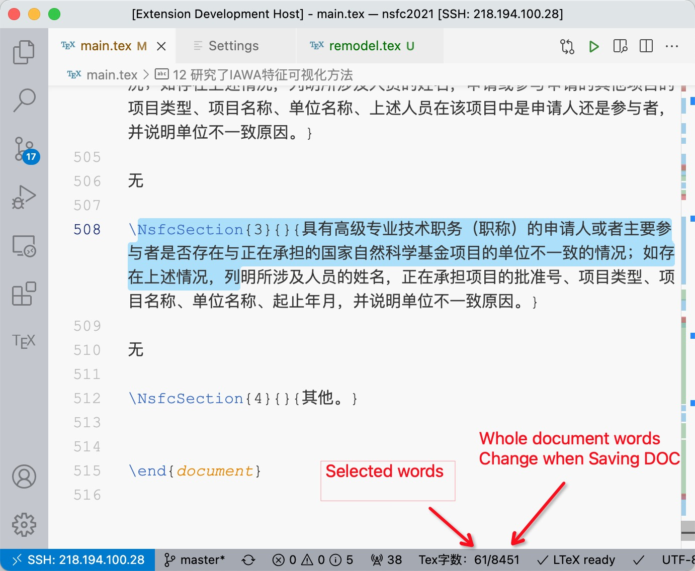

# latex-wordcount README

Latex-wordcount invokes the Texcount to calculate the words.

author: Yongke, sunyongke@gmail.com

Southwest Forestry University, Kunming, Yunnan, China.
## Features

Count the word by Texcount, exclude command, environment. Just count the words shown in the pdf file.

## Requirements

Texcount must be installed.

## Extension Settings

## Known Issues

Calling out known issues can help limit users opening duplicate issues against your extension.

## Release Notes

Users appreciate release notes as you update your extension.

### 1.0.0

